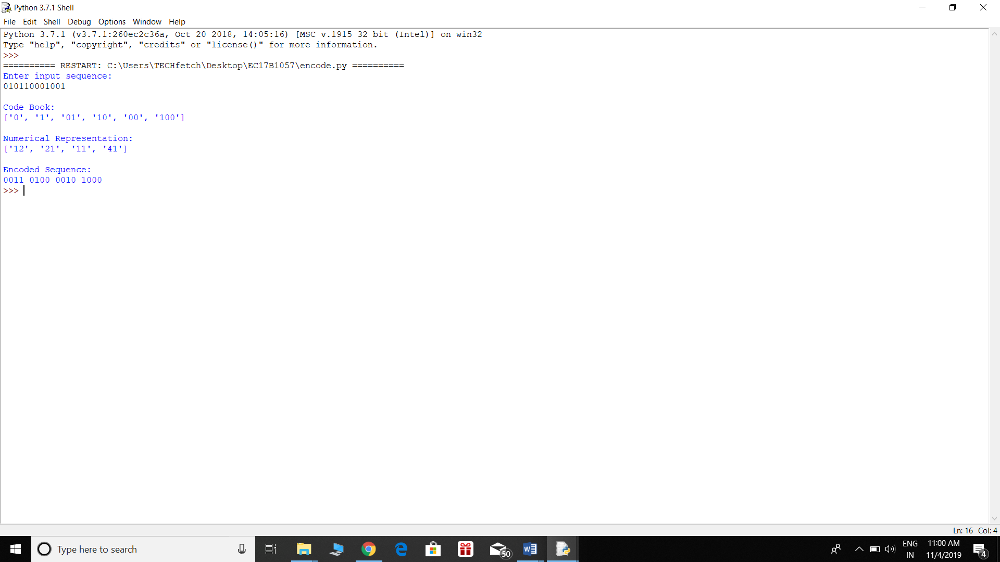
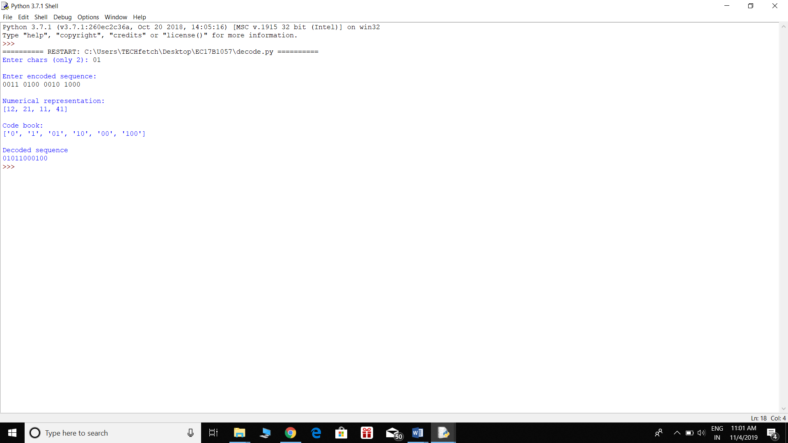

# Lempelziv coding

## Lempel-Ziv encoding algorithm

1.	Initialize the codebook with a single element ‘-1’.
2.	Scan the input sequence from start to end and add a subsequence that is not previously encountered to codebook.
3.	For every element in codebook, divide the string e into 2 parts such that first part is substring of e except last character and second part is last character of e.
4.	Obtain the numerical representation by using the index of first part in codebook as MSB and index of second part as LSB.
5.	Convert the MSB and LSB into binary to obtain the encoded sequence.

## Lempel-Ziv decoding algorithm

1.	Split the encoded sequence in bits of 4.
2.	Convert the first 3 bits into decimal and change the last bit from 0 and 1 to 1 and 2 respectively.  The new element obtained is the numerical representation of the encoded sequence.
3.	Codebook is initialized by with ‘-1’ and two other inputs given by the user.
4.	 Except the last digit in the numerical representation all others are replaced with the element present in the codebook for this index and the last digit is considered separately and undergoes the same operation. Both are concatenated and added to the codebook.
5.	Step 4 repeats for all the elements in the numerical representation.
6.	The codebook is generated from the input sequence.
7.	 The elements in the codebook is concatenated as string and given as output.

## Outputs

### Encoding
 
 
 ### Decoding
 
  
  
  
  
  
  
  
  
  
  
  
  
 
 
 

 
